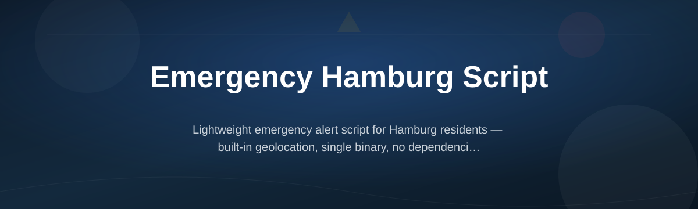

  

# hbg-emergency-alert

*A local Windows tool that replays Hamburg's public emergency alert routine for drills, training, and accessibility setups — no phone, no signal, no app store required.*

## What this is

hbg-emergency-alert is a small Windows script built to mirror how Hamburg's public warning system behaves during a siren test or civil protection drill. It plays the same alert cadence, shows a matching on-screen notice, and logs the event locally, so anyone running a drill in a school, care facility, or community building doesn't have to rely on a mobile network or the official app being installed on every machine in the room.

The project exists because real drills often happen in places where phones are locked away, Wi-Fi is unreliable, or IT policy blocks new apps. hbg-emergency-alert runs as a standalone executable on a regular Windows PC, so a coordinator can trigger a realistic, repeatable alert sequence on demand — during training sessions, awareness days, or when testing a backup control room setup.

### Before and after

| Situation | Before | After |
|---|---|---|
| Running a siren drill in a school without phones in reach | Coordinator reads a script aloud, timing is inconsistent | hbg-emergency-alert plays the real cadence and notice automatically |
| Testing a backup control room PC with no internet | No way to simulate an alert without the official app or network | Alert runs fully offline, straight from the local machine |
| Recording that a drill actually happened | Manual notes, easy to forget or lose | Local log file with timestamp is created automatically |
| Volunteers new to the project want to help | Unclear where to start or what's safe to touch | Clear "good first issue" list and a script simple enough to read in one sitting |

